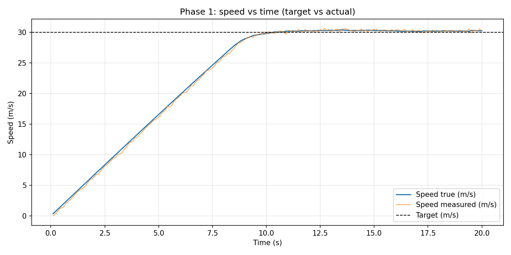

# ECU Simulation Dashboard

*No garage required. If something oscillates wildly, that’s either PID drama or Monday — we’ll help you tell the difference.*

Real-time ECU simulation with a FastAPI backend and React dashboard for live PID tuning, analysis, and ML-based tuning suggestions.

## What Is Included

- Vehicle simulation with PID throttle control (`simulation/`)
- FastAPI API + WebSocket telemetry streaming (`backend/main.py`)
- React dashboard with live chart, throttle gauge, and control sliders (`frontend/`)
- Phase 6 logging/analysis endpoints (summary, CSV export, plot)
- Phase 7 tuning assistant (`POST /tuning/suggest`) using a shipped Random Forest classifier in `ml/artifacts/`

## Quick Start

### 1) Install backend dependencies

```bash
pip install -r requirements.txt
```

### 2) Run backend

```bash
uvicorn backend.main:app --reload
```

### 3) Run frontend

```bash
cd frontend
npm install
npm run dev
```

Backend: `http://127.0.0.1:8000`  
Frontend (Vite): shown in terminal (usually `http://127.0.0.1:5173`)

## Screenshots

### Live dashboard (browser)

.png)

The React UI streams telemetry over WebSocket (`WS LIVE`). The chart compares actual vs target speed; the ring shows commanded throttle; sliders push updates to `PUT /control/`. Use **New test (reset run)** to zero the plant and restart the sim clock. Lower on the same page: logging/analysis and **Suggest tuning action** / **Apply nudge** (not always visible in a cropped capture).

### Training the tuning classifier (editor + terminal)

.png)

Example workflow: open `ml/data/tuning_runs.csv` (features + labels per simulation run), then train with `python ml/train_tuning_classifier.py --data ml/data/tuning_runs.csv --out-dir ml/artifacts`.  
The terminal output shows validation accuracy and a confusion matrix over classes such as `increase_kp`, `reduce_ki`, and `no_change`.

### Offline simulation plot (CLI)



Generated by the standalone simulator (e.g. `python simulation/main.py --target 30 ... --plot simulation/phase1_speed.png`). Blue: true speed; orange: measured speed with noise; dashed line: target. Useful as a baseline before using the live API and dashboard.

## Core API

- `GET /telemetry/` - current speed, target, throttle, sim time
- `GET /control/` - current PID gains + target
- `PUT /control/` - update PID gains + target
- `POST /simulation/reset` - reset run state (speed/PID/log clock)
- `POST /analysis/log/reset` - clear analysis buffer
- `GET /analysis/summary` - overshoot, settling time, steady-state error, etc.
- `GET /analysis/export.csv` - CSV download of logged run
- `GET /analysis/plot.png` - speed/target/throttle plot for current log
- `POST /tuning/suggest` (same as `/tuning/classify`) - ML suggestion response:
  - `action`
  - `probabilities`
  - `rationale`

WebSocket telemetry:

- `ws://127.0.0.1:8000/ws/telemetry`

## ML Tuning Assistant

### Artifacts

Stored in `ml/artifacts/`:

- `tuning_classifier.joblib`
- `label_classes.json`
- `metrics.json`
- `feature_importances_rf.txt`
- `logistic_coefficients.txt`

### Train / Regenerate

```bash
python ml/generate_tuning_dataset.py --output ml/data/tuning_runs.csv --n 2000 --seed 42
python ml/train_tuning_classifier.py --data ml/data/tuning_runs.csv --out-dir ml/artifacts
```

Notebook: `ml/tuning_walkthrough.ipynb`

### Important Limits

- Suggestions are **candidate actions**, not guaranteed optimal PID gains.
- Model behavior is tied to the training distribution used for `ml/data/tuning_runs.csv`.
- Always re-check Phase 6 metrics after applying nudges.

## Validation Snapshot (Phase G)

Fixed scenario:

- Baseline: `target=40.0`, `kp=0.12`, `ki=0.00`, `kd=0.00`
- Suggestion from API: `increase_kp`
- Applied nudge: `kp + 0.05` -> `kp=0.17`

Observed metrics (12s runs):

- Before: `steady_state_error_m_s=5.5618`, `mean_abs_error_m_s=20.2416`
- After: `steady_state_error_m_s=5.0365`, `mean_abs_error_m_s=20.1374`

## Project Layout

- `backend/` - FastAPI app, analysis, rule labels, tuning inference
- `frontend/` - React dashboard UI
- `simulation/` - simulation and PID/vehicle/actuator logic
- `ml/` - dataset generation, model training, artifacts, notebook
- `docs/` - design notes

---

If the car in your head is still doing burnouts while the plot says “steady state,” that’s not a bug — that’s *character*. Now go tune something responsibly, or at least blame the integral term like the rest of us.
